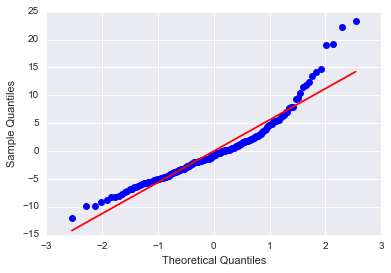
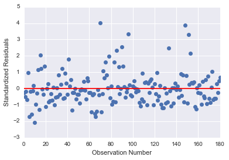
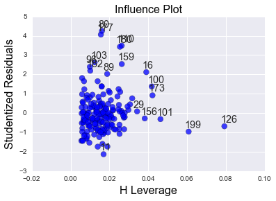

# Determine what other variables affect the suicide rate in addition to the alcohol consumption

## Data

Data for this study comes from the Gapminder World Dataset collected by the Gapminder Foundation. The Gapminder World Dataset contains data collected from more than 200 countries/areas for more 500 variables.

## Conclusion from earlier study

In the earlier study available [here](https://github.com/MriP/Regression-Practice/blob/master/assignment2.md), where in we tried to infer if suicide rate is affected by the alcohol consumption rate. We found that the **R-squared** value was 0.126 which means that only 12.6% of the variability in the response variable (suicide rate) is explained by the Alcolhol consumption. This means that there are other variables affecting the suicide rate. 

In addition to the "Alcohol Consumption", we now consider additional explatory variables like "Employment Rate", "Income per Person" and "Urban Rate". "No of Suicides" continues to be our response variable.

## Description of Variables

Below is the description of the variables

1. **No of Suicides** (variable code: suicideper100th, Unit: Numbers per 100K) - No of suicides per 100K.
2. **Alcohol Consumption** (variable code: alcconsumption, Unit: Litres) - Alcohol consumed in litres by an adult.
3. **Employment Rate** (variable code: employrate, Unit: Percentage) - Employed adults (age > 15) as a percentage of the total population
4. **Income per Person** (variable code: incomeperperson, Unit: Currency USD) - Per capita income measured in constant USD (year 2000) with the inflation taken into account.
5. **Urban Rate** (variable code: urbanrate, Unit: Percentage) - Percentage of population living in urban areas

### Import the libraries and loading the data into a pandas dataframe

    import numpy as np
    import pandas as pd
    import statsmodels.api as sm
    import statsmodels.formula.api as smf
    import seaborn as seaborn
    import pylab
    
    # bug fix for display formats to avoid run time errors
    pd.set_option('display.float_format', lambda x:'%.3f'%x)
    
    # Loading the data 
    data = pd.read_csv('gapminder.csv')
    
    

### Converting variables to numeric

    # convert variables to numeric format using convert_objects function
    data['alcconsumption'] = pd.to_numeric(data['alcconsumption'], errors='coerce')
    data['suicideper100th'] = pd.to_numeric(data['suicideper100th'], errors='coerce')
    data['employrate'] = pd.to_numeric(data['employrate'], errors='coerce')
    data['incomeperperson'] = pd.to_numeric(data['incomeperperson'], errors='coerce')
    data['urbanrate'] = pd.to_numeric(data['urbanrate'], errors='coerce')

### First few observations of the dataset

    data.head()

<table border="1" class="dataframe">
  <thead>
    <tr style="text-align: right;">
      <th></th>
      <th>country</th>
      <th>incomeperperson</th>
      <th>alcconsumption</th>
      <th>armedforcesrate</th>
      <th>breastcancerper100th</th>
      <th>co2emissions</th>
      <th>femaleemployrate</th>
      <th>hivrate</th>
      <th>internetuserate</th>
      <th>lifeexpectancy</th>
      <th>oilperperson</th>
      <th>polityscore</th>
      <th>relectricperperson</th>
      <th>suicideper100th</th>
      <th>employrate</th>
      <th>urbanrate</th>
    </tr>
  </thead>
  <tbody>
    <tr>
      <th>0</th>
      <td>Afghanistan</td>
      <td>nan</td>
      <td>0.030</td>
      <td>.5696534</td>
      <td>26.8</td>
      <td>75944000</td>
      <td>25.6000003814697</td>
      <td></td>
      <td>3.65412162280064</td>
      <td>48.673</td>
      <td></td>
      <td>0</td>
      <td></td>
      <td>6.684</td>
      <td>55.700</td>
      <td>24.040</td>
    </tr>
    <tr>
      <th>1</th>
      <td>Albania</td>
      <td>1914.997</td>
      <td>7.290</td>
      <td>1.0247361</td>
      <td>57.4</td>
      <td>223747333.333333</td>
      <td>42.0999984741211</td>
      <td></td>
      <td>44.9899469578783</td>
      <td>76.918</td>
      <td></td>
      <td>9</td>
      <td>636.341383366604</td>
      <td>7.699</td>
      <td>51.400</td>
      <td>46.720</td>
    </tr>
    <tr>
      <th>2</th>
      <td>Algeria</td>
      <td>2231.993</td>
      <td>0.690</td>
      <td>2.306817</td>
      <td>23.5</td>
      <td>2932108666.66667</td>
      <td>31.7000007629394</td>
      <td>.1</td>
      <td>12.5000733055148</td>
      <td>73.131</td>
      <td>.42009452521537</td>
      <td>2</td>
      <td>590.509814347428</td>
      <td>4.849</td>
      <td>50.500</td>
      <td>65.220</td>
    </tr>
    <tr>
      <th>3</th>
      <td>Andorra</td>
      <td>21943.340</td>
      <td>10.170</td>
      <td></td>
      <td></td>
      <td></td>
      <td></td>
      <td></td>
      <td>81</td>
      <td></td>
      <td></td>
      <td></td>
      <td></td>
      <td>5.362</td>
      <td>nan</td>
      <td>88.920</td>
    </tr>
    <tr>
      <th>4</th>
      <td>Angola</td>
      <td>1381.004</td>
      <td>5.570</td>
      <td>1.4613288</td>
      <td>23.1</td>
      <td>248358000</td>
      <td>69.4000015258789</td>
      <td>2</td>
      <td>9.99995388324075</td>
      <td>51.093</td>
      <td></td>
      <td>-2</td>
      <td>172.999227388199</td>
      <td>14.555</td>
      <td>75.700</td>
      <td>56.700</td>
    </tr>
  </tbody>
</table>

### Centering the explantory variables

    # Creating a new column for alcohol consumption which is centered
    # Generated by subtracting the mean from the column variables.
    data['centered_alc_consump'] = data['alcconsumption'] - data['alcconsumption'].mean()
    data['centered_employrate'] = data['employrate'] - data['employrate'].mean()
    data['centered_incomeperperson'] = data['incomeperperson'] - data['incomeperperson'].mean()
    data['centered_urbanrate'] = data['urbanrate'] - data['urbanrate'].mean()
    

### View of the data now

    data.head()

<table border="1" class="dataframe">
  <thead>
    <tr style="text-align: right;">
      <th></th>
      <th>country</th>
      <th>incomeperperson</th>
      <th>alcconsumption</th>
      <th>armedforcesrate</th>
      <th>breastcancerper100th</th>
      <th>co2emissions</th>
      <th>femaleemployrate</th>
      <th>hivrate</th>
      <th>internetuserate</th>
      <th>lifeexpectancy</th>
      <th>oilperperson</th>
      <th>polityscore</th>
      <th>relectricperperson</th>
      <th>suicideper100th</th>
      <th>employrate</th>
      <th>urbanrate</th>
      <th>centered_alc_consump</th>
      <th>centered_employrate</th>
      <th>centered_incomeperperson</th>
      <th>centered_urbanrate</th>
    </tr>
  </thead>
  <tbody>
    <tr>
      <th>0</th>
      <td>Afghanistan</td>
      <td>nan</td>
      <td>0.030</td>
      <td>.5696534</td>
      <td>26.8</td>
      <td>75944000</td>
      <td>25.6000003814697</td>
      <td></td>
      <td>3.65412162280064</td>
      <td>48.673</td>
      <td></td>
      <td>0</td>
      <td></td>
      <td>6.684</td>
      <td>55.700</td>
      <td>24.040</td>
      <td>-6.659</td>
      <td>-2.936</td>
      <td>nan</td>
      <td>-32.729</td>
    </tr>
    <tr>
      <th>1</th>
      <td>Albania</td>
      <td>1914.997</td>
      <td>7.290</td>
      <td>1.0247361</td>
      <td>57.4</td>
      <td>223747333.333333</td>
      <td>42.0999984741211</td>
      <td></td>
      <td>44.9899469578783</td>
      <td>76.918</td>
      <td></td>
      <td>9</td>
      <td>636.341383366604</td>
      <td>7.699</td>
      <td>51.400</td>
      <td>46.720</td>
      <td>0.601</td>
      <td>-7.236</td>
      <td>-6825.970</td>
      <td>-10.049</td>
    </tr>
    <tr>
      <th>2</th>
      <td>Algeria</td>
      <td>2231.993</td>
      <td>0.690</td>
      <td>2.306817</td>
      <td>23.5</td>
      <td>2932108666.66667</td>
      <td>31.7000007629394</td>
      <td>.1</td>
      <td>12.5000733055148</td>
      <td>73.131</td>
      <td>.42009452521537</td>
      <td>2</td>
      <td>590.509814347428</td>
      <td>4.849</td>
      <td>50.500</td>
      <td>65.220</td>
      <td>-5.999</td>
      <td>-8.136</td>
      <td>-6508.973</td>
      <td>8.451</td>
    </tr>
    <tr>
      <th>3</th>
      <td>Andorra</td>
      <td>21943.340</td>
      <td>10.170</td>
      <td></td>
      <td></td>
      <td></td>
      <td></td>
      <td></td>
      <td>81</td>
      <td></td>
      <td></td>
      <td></td>
      <td></td>
      <td>5.362</td>
      <td>nan</td>
      <td>88.920</td>
      <td>3.481</td>
      <td>nan</td>
      <td>13202.374</td>
      <td>32.151</td>
    </tr>
    <tr>
      <th>4</th>
      <td>Angola</td>
      <td>1381.004</td>
      <td>5.570</td>
      <td>1.4613288</td>
      <td>23.1</td>
      <td>248358000</td>
      <td>69.4000015258789</td>
      <td>2</td>
      <td>9.99995388324075</td>
      <td>51.093</td>
      <td></td>
      <td>-2</td>
      <td>172.999227388199</td>
      <td>14.555</td>
      <td>75.700</td>
      <td>56.700</td>
      <td>-1.119</td>
      <td>17.064</td>
      <td>-7359.962</td>
      <td>-0.069</td>
    </tr>
  </tbody>
</table>

### Generating the Regression Model

**Alcohol Consumption** is our primary explanatory variable. Adding explanatory variables one at a time. 

Adding "**Employment Rate**"

    reg_model = smf.ols(formula='suicideper100th ~ centered_alc_consump + centered_employrate', data=data).fit()
    print (reg_model.summary())
    

                                OLS Regression Results                            
    ==============================================================================
    Dep. Variable:        suicideper100th   R-squared:                       0.140
    Model:                            OLS   Adj. R-squared:                  0.130
    Method:                 Least Squares   F-statistic:                     13.28
    Date:                Fri, 24 Jun 2016   Prob (F-statistic):           4.56e-06
    Time:                        21:20:00   Log-Likelihood:                -532.75
    No. Observations:                 166   AIC:                             1071.
    Df Residuals:                     163   BIC:                             1081.
    Df Model:                           2                                         
    Covariance Type:            nonrobust                                         
    ========================================================================================
                               coef    std err          t      P>|t|      [95.0% Conf. Int.]
    ----------------------------------------------------------------------------------------
    Intercept                9.9630      0.470     21.194      0.000         9.035    10.891
    centered_alc_consump     0.4847      0.094      5.138      0.000         0.298     0.671
    centered_employrate      0.0491      0.046      1.069      0.287        -0.042     0.140
    ==============================================================================
    Omnibus:                       51.691   Durbin-Watson:                   2.052
    Prob(Omnibus):                  0.000   Jarque-Bera (JB):              115.153
    Skew:                           1.374   Prob(JB):                     9.88e-26
    Kurtosis:                       6.016   Cond. No.                         10.4
    ==============================================================================
    
    Warnings:
    [1] Standard Errors assume that the covariance matrix of the errors is correctly specified.
    

Employment Rate has a non-significant P value, but it doesn't confound the relationship between Suicide Rate and Alcohol Consumption. Employment Rate is not significantly associated with Suicide Rate.

Adding "**Income per Person**"

    reg_model = smf.ols(formula='suicideper100th ~ centered_alc_consump + centered_employrate + centered_incomeperperson', data=data).fit()
    print (reg_model.summary())
    

                                OLS Regression Results                            
    ==============================================================================
    Dep. Variable:        suicideper100th   R-squared:                       0.176
    Model:                            OLS   Adj. R-squared:                  0.160
    Method:                 Least Squares   F-statistic:                     11.24
    Date:                Fri, 24 Jun 2016   Prob (F-statistic):           1.00e-06
    Time:                        21:20:00   Log-Likelihood:                -512.64
    No. Observations:                 162   AIC:                             1033.
    Df Residuals:                     158   BIC:                             1046.
    Df Model:                           3                                         
    Covariance Type:            nonrobust                                         
    ============================================================================================
                                   coef    std err          t      P>|t|      [95.0% Conf. Int.]
    --------------------------------------------------------------------------------------------
    Intercept                    9.7246      0.462     21.047      0.000         8.812    10.637
    centered_alc_consump         0.5585      0.096      5.801      0.000         0.368     0.749
    centered_employrate          0.0435      0.044      0.979      0.329        -0.044     0.131
    centered_incomeperperson  -7.49e-05   4.55e-05     -1.645      0.102        -0.000   1.5e-05
    ==============================================================================
    Omnibus:                       41.150   Durbin-Watson:                   2.076
    Prob(Omnibus):                  0.000   Jarque-Bera (JB):               81.168
    Skew:                           1.163   Prob(JB):                     2.37e-18
    Kurtosis:                       5.571   Cond. No.                     1.07e+04
    ==============================================================================
    
    Warnings:
    [1] Standard Errors assume that the covariance matrix of the errors is correctly specified.
    [2] The condition number is large, 1.07e+04. This might indicate that there are
    strong multicollinearity or other numerical problems.
    

"Income Per Person" has a non-significant P value, but it doesn't confound the relationship between Suicide Rate and Alcohol Consumption. Income Per Person is not significantly associated with Suicide Rate.

Adding "**Urban Rate**"

    reg_model = smf.ols(formula='suicideper100th ~ centered_alc_consump + centered_employrate + centered_incomeperperson + centered_urbanrate', data=data).fit()
    print (reg_model.summary())
    

                                OLS Regression Results                            
    ==============================================================================
    Dep. Variable:        suicideper100th   R-squared:                       0.226
    Model:                            OLS   Adj. R-squared:                  0.206
    Method:                 Least Squares   F-statistic:                     11.46
    Date:                Fri, 24 Jun 2016   Prob (F-statistic):           3.45e-08
    Time:                        21:20:00   Log-Likelihood:                -507.56
    No. Observations:                 162   AIC:                             1025.
    Df Residuals:                     157   BIC:                             1041.
    Df Model:                           4                                         
    Covariance Type:            nonrobust                                         
    ============================================================================================
                                   coef    std err          t      P>|t|      [95.0% Conf. Int.]
    --------------------------------------------------------------------------------------------
    Intercept                    9.8211      0.450     21.814      0.000         8.932    10.710
    centered_alc_consump         0.5945      0.094      6.306      0.000         0.408     0.781
    centered_employrate         -0.0155      0.047     -0.329      0.743        -0.108     0.077
    centered_incomeperperson  2.956e-05   5.51e-05      0.537      0.592     -7.92e-05     0.000
    centered_urbanrate          -0.0862      0.027     -3.189      0.002        -0.140    -0.033
    ==============================================================================
    Omnibus:                       38.743   Durbin-Watson:                   2.129
    Prob(Omnibus):                  0.000   Jarque-Bera (JB):               70.010
    Skew:                           1.142   Prob(JB):                     6.27e-16
    Kurtosis:                       5.270   Cond. No.                     1.07e+04
    ==============================================================================
    
    Warnings:
    [1] Standard Errors assume that the covariance matrix of the errors is correctly specified.
    [2] The condition number is large, 1.07e+04. This might indicate that there are
    strong multicollinearity or other numerical problems.
    

"Urban Rate" has a significant P value, but it doesn't confound the relationship between Suicide Rate and Alcohol Consumption. Urban Rate is significantly and negatively associated with Suicide Rate.

###Revising the model

Keeping only the "Alcohol Consumption" and "Urban Rate" as explanatory variables.

    reg_model = smf.ols(formula='suicideper100th ~ centered_alc_consump + centered_urbanrate', data=data).fit()
    print (reg_model.summary())

                                OLS Regression Results                            
    ==============================================================================
    Dep. Variable:        suicideper100th   R-squared:                       0.177
    Model:                            OLS   Adj. R-squared:                  0.168
    Method:                 Least Squares   F-statistic:                     19.19
    Date:                Fri, 24 Jun 2016   Prob (F-statistic):           2.84e-08
    Time:                        21:20:00   Log-Likelihood:                -572.75
    No. Observations:                 181   AIC:                             1152.
    Df Residuals:                     178   BIC:                             1161.
    Df Model:                           2                                         
    Covariance Type:            nonrobust                                         
    ========================================================================================
                               coef    std err          t      P>|t|      [95.0% Conf. Int.]
    ----------------------------------------------------------------------------------------
    Intercept                9.5583      0.431     22.188      0.000         8.708    10.408
    centered_alc_consump     0.5385      0.091      5.935      0.000         0.359     0.718
    centered_urbanrate      -0.0657      0.020     -3.359      0.001        -0.104    -0.027
    ==============================================================================
    Omnibus:                       53.336   Durbin-Watson:                   2.065
    Prob(Omnibus):                  0.000   Jarque-Bera (JB):              117.432
    Skew:                           1.330   Prob(JB):                     3.16e-26
    Kurtosis:                       5.915   Cond. No.                         23.1
    ==============================================================================
    
    Warnings:
    [1] Standard Errors assume that the covariance matrix of the errors is correctly specified.
    

## Evaluating Model Fit

Drawing a QQ Plot

    import statsmodels.api as sm
    import pylab
    %matplotlib inline
    qq_plot = sm.qqplot(reg_model.resid, line='r')
    pylab.show()

From the above plot, it appears that the residuals generally don't follow the straight line and also deviates at lower and higher quantiles. The residuals dont follow a normal distribution. The association between the response variable and the explantory variable may not be linear and there may be other explantory variables whose inclusion can improve the model.

### Standardized Residuals

    import matplotlib.pyplot as plt
    
    stdres = pd.DataFrame(reg_model.resid_pearson)
    plot = plt.plot(stdres, 'o', ls='None')
    l = plt.axhline(y=0, color='r')
    plt.ylabel("Standardized Residuals")
    plt.xlabel("Observation Number")
    print(plot)

    [<matplotlib.lines.Line2D object at 0x000000000A5442B0>]
    

As can be seen from the above plot, more than 1% of our observation (4 out of 181 observation) has standardized residuals with an absolute value greater than 2.5. This suggests that level of error within our model is unacceptable and the **model is a fairly poor fit** to the observed data. The model could be **improved**.

There are observations with residual values which are more than 2 times the standard deviation from the mean. These are **outliers**. 

There are observations with residual values which are more than 3 times the standard deviation from the mean. These are **extreme outliers**.

    lev_plot = sm.graphics.influence_plot(reg_model, size=8)

As can be seen from the leverage plot both outliers and extreme outliers have small leverage values (< 0.04). Although they are outliers they don not have an undue influence on the estimation of the regression model. 

There are other obervations which have high leverage values but those are not outliers (For e.g. observation number 199 and 126).

    

    
